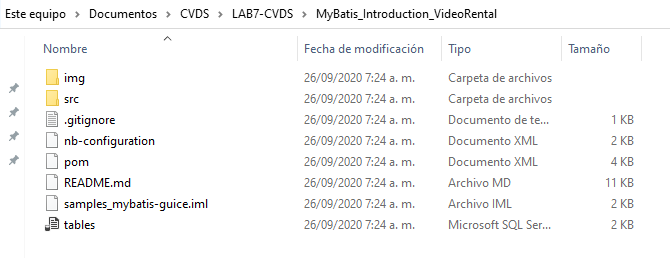
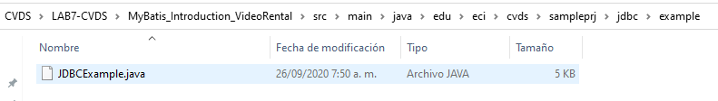
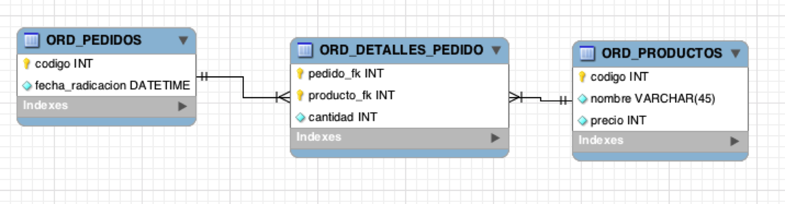
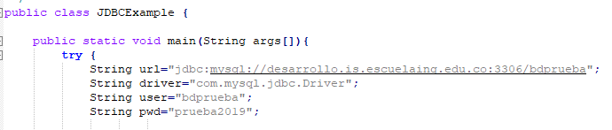
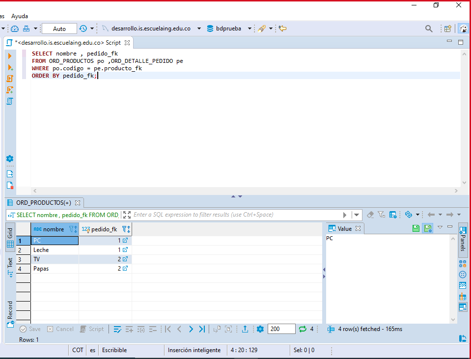
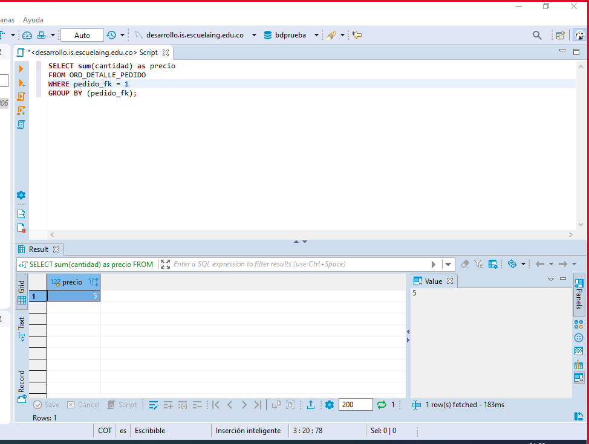

# LAB7-CVDS
# Escuela Colombiana de Ingeniería
# Ciclos de vida del Desarrollo de Software

**********************************************************
----------------------------------------------------------
**********************************************************
### Datos básicos
 * **Nombres:** David Fernando Rivera\
				Janer Stiven Vanegas
				
				
**********************************************************
----------------------------------------------------------
**********************************************************

## Sección I. - Introducción a JDBC
1. Clonar el proyecto MyBatis_Introduction_VideoRental de GitHub donde se realizará la implementación completa del laboratorio.
	
2. Descargue el archivo JDBCExample.java y agreguelo en el paquete "edu.eci.cvds.sampleprj.jdbc.example".
	
3. Desde esta clase se realizará una conexión a una base de datos MySQL por medio de JDBC y sus "Prepared Statements".

4. En un motor de base de datos SQL se tiene un esquema con el siguiente modelo de base de datos (para registrar pedidos sobre productos):Model.png
	
	


5. Revise la documentación de ‘PreparedStatement’, del API JDBC.

6. En la clase JDBCExample juste los parámetros de conexión a la base de datos con los datos reales:
	```
	Url: jdbc:mysql://desarrollo.is.escuelaing.edu.co:3306/bdprueba
	Driver: com.mysql.jdbc.Driver
	Usuario: bdprueba
	Contraseña: prueba2019
	```
	
	
7. Implemente las operaciones faltantes:
	1. nombresProductosPedido
	2. valorTotalPedido - El resultado final lo debe retornar la base de datos, no se deben hacer operaciones en memoria.
	3. registrarNuevoProducto - Use su código de estudiante para evitar colisiones.

8. Verifique por medio de un cliente SQL, que la información retornada por el programa coincide con la que se encuentra almacenada en base de datos.
	```
	
	SELECT nombre , pedido_fk 
	FROM ORD_PRODUCTOS po ,ORD_DETALLE_PEDIDO pe 
	WHERE po.codigo = pe.producto_fk 
	ORDER BY pedido_fk;
	
	```
	
	
	```
	
	SELECT sum(cantidad) as precio
    FROM ORD_DETALLE_PEDIDO 
    WHERE pedido_fk = 1
    GROUP BY (pedido_fk);
	
	```
	
	
	

## Sección II. - Introducción a MyBatis
1. Revise la documentación básica de MyBatis de forma que entienda para qué sirve y el uso básico que se le puede dar al framework.
2. Seguir las instrucciones que se encuentran en el repositorio de forma que en la clase MyBatisExample.java se creen los mappers necesarios y sea posible realizar la ejecución de diferentes sentencias SQL en la base de datos de pruebas.